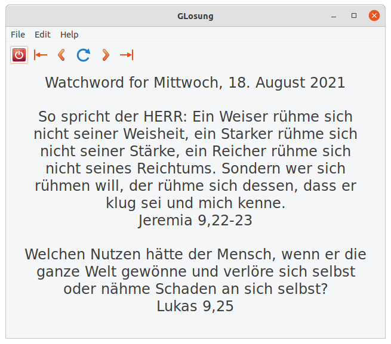

#God's Word for Every Day

Its goal is to make a user-friendly and powerful watch word (losung) program for the Linux desktop.

The official web site is: http://www.godehardt.org/losung.html

##REQUIREMENTS

    GLosung requires that you have installed a few working libraries:

      * glib/gtk+ 2.10 or higher
	See the GTK+ homepage (www.gtk.org) for information on how to
	download and install GLIB and GTK+. 

      * libxml2 (aka gnome-xml)
	See homepage (www.xmlsoft.org) for more information.

      * libcurl
	See curl homepage (curl.haxx.se) for information.

    GLosung also makes use of the 'gettext' libraries.

##Installation

See the file 'INSTALL' for instructions.

Upgrading typically requires that you do the exact same procedure as described in the INSTALL file.

##Report Bugs

Please use the GitHub's issue tracking system:
https://github.com/godehardt/glosung/issues

##URLS

glosung : http://www.godehardt.org/losung.html
GTK+    : http://www.gtk.org/